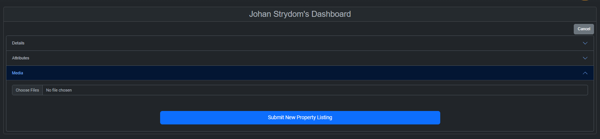

# Viva Real Estate Documentation

Welcome to the Viva Real Estate project documentation. This repository contains the codebase and documentation for the Viva Real Estate management and sales & rental portal/API.

## Table of Contents

- [Viva Real Estate Documentation](#viva-real-estate-documentation)
  - [Table of Contents](#table-of-contents)
  - [Overview](#overview)
  - [Posting and Viewing a Property](#posting-and-viewing-a-property)
    - [User-Friendly Property Submission:](#user-friendly-property-submission)
      - [Frontend Interface:](#frontend-interface)
        - [Old Dashboard Elements:](#old-dashboard-elements)
          - [Home Page:](#home-page)
          - [Menu Before Login:](#menu-before-login)
          - [Login:](#login)
          - [Menu After Login:](#menu-after-login)
          - [Dashboard:](#dashboard)
          - [Dashboard - listings:](#dashboard---listings)
          - [New Property - Details:](#new-property---details)
          - [New Property - Attributes:](#new-property---attributes)
          - [New Property - Media:](#new-property---media)
      - [Backend Processing:](#backend-processing)
    - [Comprehensive Property Display:](#comprehensive-property-display)
      - [Property Listings Page:](#property-listings-page)
      - [Dynamic Database Queries:](#dynamic-database-queries)
    - [Interaction and Communication:](#interaction-and-communication)
      - [User Engagement:](#user-engagement)
      - [Secure Data Handling:](#secure-data-handling)
    - [Conclusion:](#conclusion)

## Overview

Viva Real Estate is a comprehensive platform designed to facilitate real estate sales, property rentals, client management, agent management, and provide a space for homeowners to list their properties for sale. Additionally, the platform includes a blog and newsletter feature to keep users informed about real estate trends and news.

**Project Goals:**
- Create a user-friendly web portal for real estate sales and rentals.
- Centralize client management for efficient interaction and communication.
- Provide property owners a platform to list their properties for sale.
- Enable agents to manage their profiles, listings, and interactions.
- Deliver insightful blog content and newsletters related to the real estate industry.

**Web Portal Domain:** [vivadominican.com](https://vivadominican.com)

## Posting and Viewing a Property

The process of Posting and Viewing a Property on the Viva Real Estate platform underscores the intricate interplay between user interface and complex backend functionality. This section sheds light on the substantial coding efforts that underlie this seemingly straightforward feature.

### User-Friendly Property Submission:

#### Frontend Interface:

The frontend of the `Posting a Property` feature offers an intuitive form where agents can input details such as property type, location, price, and amenities. This form is meticulously designed to ensure a smooth user experience and seamless data collection.

##### Old Dashboard Elements:

###### Home Page:

###### Menu Before Login:

###### Login:

###### Menu After Login:

###### Dashboard:

###### Dashboard - listings:

###### New Property - Details:

###### New Property - Attributes:

###### New Property - Media:

#### Backend Processing:

However, the journey doesn't end with user inputs. Behind the scenes, an intricate backend process validates and sanitizes the submitted data. This involves intricate code segments that check for data integrity, handle potential errors, and securely store property details in the database. Additional steps, such as image uploads, require thorough code to manage file handling and storage.

### Comprehensive Property Display:

#### Property Listings Page:

On the frontend, the `Viewing a Property` experience is brought to life through dynamic property listings. A combination of frontend coding and database queries generates visually appealing property cards that encapsulate key information. This involves `HTML`, `CSS`, `SCSS`, `PHP`, `SQL`, `JQUERY`, `Blade`, `Less`, `Python`, and `JavaScript` code working together to craft an engaging presentation.

#### Dynamic Database Queries:

The backend database queries retrieve property information based on user preferences. These queries require optimization for swift data retrieval, ensuring a seamless browsing experience even as the property database grows. The intricate `SQL` or `NoSQL` queries are fine-tuned to extract relevant data efficiently.

### Interaction and Communication:

#### User Engagement:

Users can express interest in a property through frontend interactions like clicks and forms. These actions trigger backend processes that update the database, log `user engagement`, and potentially send notifications to relevant parties. The code governing this interaction is carefully structured to maintain data integrity and ensure timely communication.

#### Secure Data Handling:

`Security is paramount`, especially in real estate transactions. The backend code incorporates encryption and authentication protocols to safeguard sensitive data during property submissions and interactions. User inputs are validated and sanitized to prevent vulnerabilities and unauthorized access.

### Conclusion:

While the `Posting and Viewing a Property` feature may seem like a simple interaction, its implementation requires a harmonious orchestration of `frontend design`, `backend logic`, `database operations`, and `security measures`. The coding efforts undertaken reflect our commitment to delivering a seamless and secure experience for property owners and potential buyers alike. This section serves as a testament to the complexity and dedication involved in creating a truly `user-centric real estate platform`.
